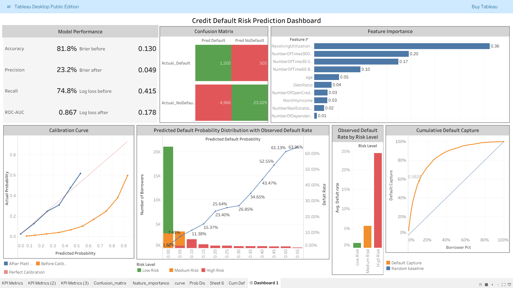

# credit-risk-prediction
Machine learning project for credit default prediction using Random Forest and probability calibration

## 📌 Overview

This project aims to predict the probability of loan default using machine learning techniques.
The model is designed to support risk assessment and improve decision-making in financial applications.

---

## 🧠 Model

* Random Forest Classifier
* Probability Calibration (to improve probability estimation)

---

## 📊 Model Performance

* Accuracy: 81.8%
* Precision: 23.2%
* Recall: 74.8%
* ROC-AUC: 0.867

### 📉 Calibration Improvement

* Brier Score (Before): 0.130
* Brier Score (After): 0.049
* Log Loss (Before): 0.415
* Log Loss (After): 0.178

---

## 📊 Dashboard

🔗 **Interactive Dashboard:**
https://public.tableau.com/views/credit_risk_17759818211850/Dashboard1

---

## 📈 Key Insights

* Model effectively distinguishes between default and non-default borrowers
* Probability calibration significantly improves prediction reliability
* High-risk segment shows substantially higher default rate
* Model demonstrates strong performance compared to random baseline

---

## 📊 Features

* Feature importance analysis (e.g., Revolving Utilization, Delinquency history)
* Risk segmentation (Low / Medium / High risk)
* Confusion Matrix for classification evaluation
* Calibration Curve for probability accuracy
* Cumulative Default Capture (Lift Analysis)

---

## 🔗 Workflow

End-to-end pipeline:
**Data → Preprocessing → Model → Calibration → Evaluation → Dashboard → Business Insight**

---

## 🛠 Tools & Technologies

* Python
* Pandas / NumPy
* Scikit-learn
* Tableau

---

## 📂 Files

* `credit-risk-report.pdf` — Project report
* `dashboard.png` — Dashboard preview

---

## ⚠️ Note

This project uses sample/simulated data for demonstration purposes only.
No real customer data is included.

---

## 📬 Contact

Email: [arisara5943@gmail.com](mailto:arisara5943@gmail.com)
GitHub: https://github.com/arisara-data
